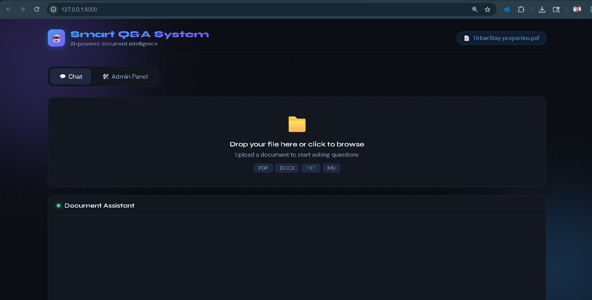
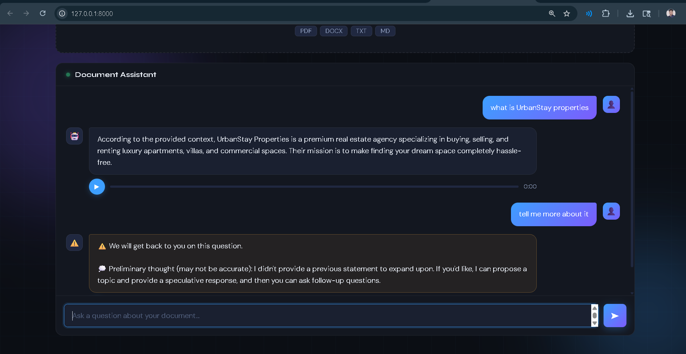
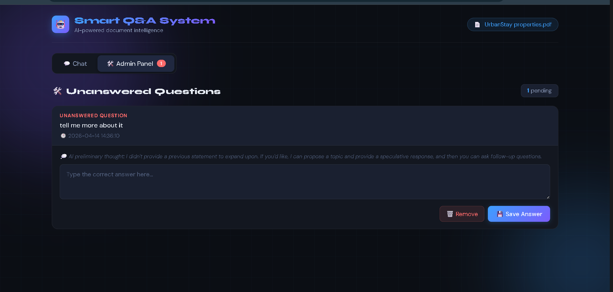

# 🚀 Smart Q&A System – AI-Powered Document Interaction Platform

**Smart Q&A System** transforms static documents into intelligent, interactive experiences.
Upload any document and instantly ask questions — the AI understands context and responds in **both text and voice**, all within a clean, real-time dashboard.

---

## ✨ Features

* 📄 **Document Upload & Processing**
  Upload PDFs and convert them into searchable knowledge.

* 🤖 **AI-Powered Q&A (RAG आधारित)**
  Ask anything related to your document and get accurate, context-aware answers.

* 🎤 **Voice + Text Responses**
  Get responses in both **text and natural voice output**.

* ⚡ **Real-Time Interaction**
  Fast responses using streaming and optimized backend pipelines.

* 🧠 **Smart Retrieval System**
  Uses embeddings + semantic search for precise answers.

* 📊 **Interactive Dashboard UI**
  Clean interface to view queries, responses, and history.

---

## 🏗️ Tech Stack

### 🔹 Backend

* FastAPI
* WebSockets (real-time streaming)
* REST APIs

### 🔹 AI / Gen AI

* LLM Integration (Groq / OpenAI)
* RAG (Retrieval-Augmented Generation)
* Embeddings + Semantic Search

### 🔹 Voice AI

* STT (Speech-to-Text)
* TTS (Text-to-Speech)

### 🔹 Database

* MongoDB / Vector DB

### 🔹 Frontend

* React.js (Dashboard UI)

---

## ⚙️ How It Works

```text
Upload Document
      ↓
Text Extraction
      ↓
Embeddings Creation
      ↓
User Query
      ↓
Semantic Search (RAG)
      ↓
LLM Response Generation
      ↓
Text + Voice Output
```

---

## 📸 Screenshots

> Add your screenshots inside `/screenshots` folder

### 📄 Upload Interface



### 💬 Chat Dashboard



### 🎤 Voice Interaction



---

## 🚀 Getting Started

### 1️⃣ Clone the Repository

```bash
git clone https://github.com/yogirajhub/Talk_My_Docks.git
cd Talk_My_Docks
```

### 2️⃣ Create Virtual Environment

```bash
python -m venv venv
source venv/bin/activate   # Windows: venv\Scripts\activate
```

### 3️⃣ Install Dependencies

```bash
pip install -r requirements.txt
```

### 4️⃣ Setup Environment Variables

Create a `.env` file:

```env
OPENAI_API_KEY=your_key
GROQ_API_KEY=your_key
DEEPGRAM_API_KEY=your_key
```

### 5️⃣ Run Backend

```bash
uvicorn main:app --reload
```

### 6️⃣ Run Frontend

```bash
cd frontend
npm install
npm start
```

---

## 📌 Use Cases

* 📚 Study assistant (notes, PDFs, books)
* 🏢 Business document analysis
* 📑 Resume / report understanding
* 🧠 Knowledge base chatbot
* 🎧 Voice-enabled document assistant

---

## 🔥 Key Highlights

* Built a **real-time AI system**, not just a chatbot
* Integrated **voice + text AI pipeline**
* Implemented **RAG for accurate responses**
* Designed for **low latency and scalability**

---

## 🚧 Future Improvements

* Multi-document support
* Conversation memory
* Advanced voice control (interrupt / barge-in)
* UI enhancements & analytics

---

## 👨‍💻 Author

**Yogiraj Gautam**
📍 Greater Noida, India

* GitHub: https://github.com/yogirajhub
* LinkedIn: https://www.linkedin.com/in/yogiraj-gautam18

---

## ⭐ Support

If you like this project, give it a ⭐ on GitHub and share it!

---

## 💡 Inspiration

Built to make documents **interactive, conversational, and intelligent** using modern Generative AI systems.
